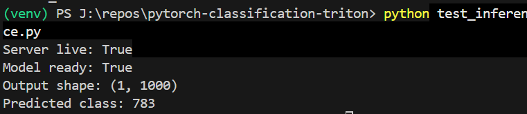
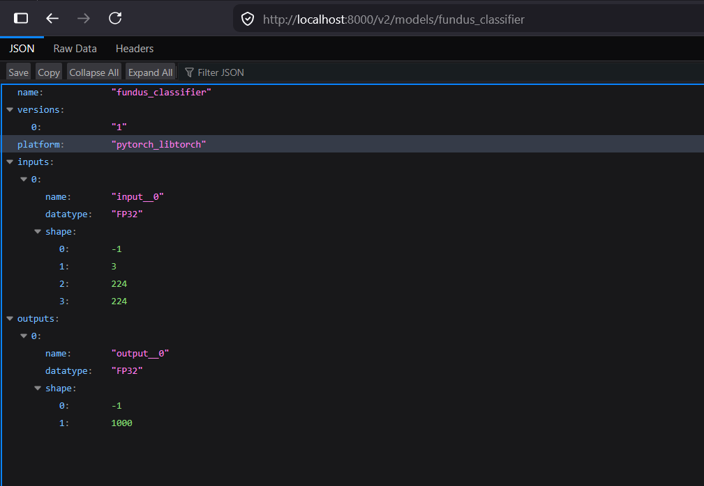

# pytorch-classification-triton

Simple example of serving PyTorch image classification models (pytorch-classification) using NVIDIA Triton Inference Server.


## Steps

**1. Export model to TorchScript:**
 
```python
import torch
import torchvision.models as models
 
model = models.resnet50(pretrained=True)
model.eval()
 
example_input = torch.rand(1, 3, 224, 224)
traced_model: torch.jit.ScriptModule = torch.jit.trace(model, example_input)
traced_model.save("model_repository/fundus_classifier/1/model.pt")
```
 
**2. Start Triton server:**
 
(Requires loggin in to nvcr.io with API key)

```bash
docker run --rm -it \
  -p8000:8000 -p8001:8001 -p8002:8002 \
  -v /path/to/model_repository:/models \
  nvcr.io/nvidia/tritonserver:24.05-py3 \
  tritonserver --model-repository=/models
```
 
Wait for:
```
Started HTTPService at 0.0.0.0:8000
```
 
**3. Run inference:**
 
```python
import tritonclient.http as httpclient
import numpy as np
 
client = httpclient.InferenceServerClient("localhost:8000")
 
input_data = np.random.rand(1, 3, 224, 224).astype(np.float32)
inputs = [httpclient.InferInput("input__0", input_data.shape, "FP32")]
inputs[0].set_data_from_numpy(input_data)
outputs = [httpclient.InferRequestedOutput("output__0")]
 
result = client.infer("fundus_classifier", inputs, outputs=outputs)
output = result.as_numpy("output__0")
 
print("Output shape:", output.shape)
print("Predicted class:", output.argmax())
```
 
## Output



```
Server live: True
Model ready: True
Output shape: (1, 1000)
Predicted class: 783
```


---

